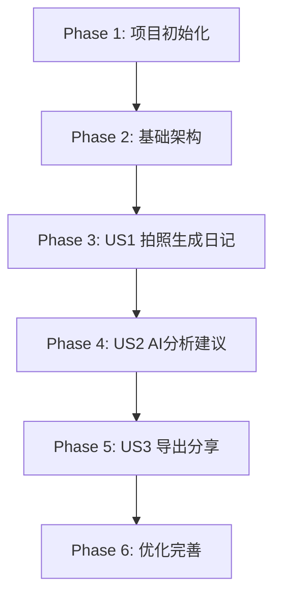

# 儿童拍照智能日记 - 任务清单

**目标**: 将前端技术栈从uni-app切换到Vue 3，实现拍照分析、日记生成、保存管理等核心功能

## 总体信息

* **总任务数**: 28

* **并行机会**: 12个任务可并行执行

* **MVP范围**: 用户故事1（拍照生成日记）

* **预计时间**: 12小时（1.5天）

## 依赖关系图



## 实施阶段

### ✅ Phase 1: 项目初始化 (已完成)

**目标**: 创建Vue 3项目基础结构，配置开发环境

* [x] ✅ T001 创建Vue 3 + TypeScript项目结构 `frontend/vue3-web/`

* [x] ✅ T002 \[P] 配置Vite构建工具和开发服务器

* [x] ✅ T003 \[P] 安装核心依赖：vue-router, pinia, axios

* [x] ✅ T004 \[P] 配置TypeScript和ESLint代码规范

* [x] ✅ T005 创建基础目录结构：components, services, stores, types, utils

**独立测试标准**: 项目能正常启动，开发服务器运行正常

### Phase 2: 基础架构 (2小时)

**目标**: 建立核心服务层和数据模型

* [ ] T006 创建TypeScript类型定义（与后端数据模型对齐）

* [ ] T007 实现localStorage服务替代uni-app Storage

* [ ] T008 创建API服务层，封装后端接口调用

* [ ] T009 \[P] 实现文件上传服务（图片选择和Base64转换）

* [ ] T010 创建Pinia状态管理store（日记、草稿、用户状态）

* [ ] **T031 [高优先级] 修复前后端接口一致性问题**
  - 统一日记数据结构 (DiaryEntry 字段映射)
  - 添加后端日记创建接口 POST /v1/diary-entries
  - 统一时间格式处理 (ts vs created_at)
  - 完善照片分析接口参数 (regionHint)

**独立测试标准**: 各服务层能独立测试，API调用正常，前后端数据结构完全匹配

### Phase 3: US1 拍照生成日记 (4小时)

**目标**: 实现拍照后自动生成文字并保存为日记的核心功能

* [ ] T011 \[US1] 创建拍照组件（文件选择+预览）

* [ ] T012 \[US1] 实现图片压缩和Base64编码

* [ ] T013 \[US1] 调用后端分析API获取日记文本

* [ ] T014 \[US1] 创建文本编辑组件（可编辑的日记内容）

* [ ] T015 \[US1] 实现保存草稿功能

* [ ] T016 \[US1] 实现保存日记功能（状态管理+本地存储）

* [ ] T017 \[US1] 创建日记列表页面

* [ ] T018 \[US1] 实现删除日记功能

**独立测试标准**: 完整流程：拍照→分析→编辑→保存→列表展示→删除

### Phase 4: US2 AI分析建议 (2小时)

**目标**: 展示AI分析的状态、天气、心情和建议

* [ ] T019 \[US2] 创建分析结果展示组件（状态、天气、心情）

* [ ] T020 \[US2] 实现建议列表组件（分类展示）

* [ ] T021 \[US2] 添加建议到日记文本功能

* [ ] T022 \[US2] 实现置信度显示和错误处理

**独立测试标准**: 分析结果能正确展示，建议可选择性添加到日记

### Phase 5: US3 导出分享 (2小时)

**目标**: 实现图片导出和分享功能

* [ ] T023 \[US3] 实现文字叠加图片生成功能

* [ ] T024 \[US3] 创建导出选项组件（原图/叠加图）

* [ ] T025 \[US3] 实现图片下载功能

* [ ] T026 \[US3] 集成Web Share API（浏览器分享）

**独立测试标准**: 能成功导出带文字的合成图片，支持分享

### Phase 6: 优化完善 (2小时)

**目标**: 添加错误处理、加载状态、响应式设计等

* [ ] T027 实现全局错误处理和用户提示

* [ ] T028 添加加载状态指示器和骨架屏

* [ ] T029 \[P] 实现响应式设计（移动端适配）

* [ ] T030 添加离线状态检测和提示

**独立测试标准**: 用户体验流畅，错误处理完善，移动端适配良好

## 并行执行示例

### 用户故事1并行任务（最多4个并行）:

```bash
# 并行执行拍照组件和API服务
- T011 [US1] 创建拍照组件（文件选择+预览）
- T013 [US1] 调用后端分析API获取日记文本

# 并行执行状态管理和UI组件
- T015 [US1] 实现保存草稿功能
- T017 [US1] 创建日记列表页面
```

### 基础架构并行任务（最多3个并行）:

```bash
# 并行开发不同服务层
- T007 实现localStorage服务替代uni-app Storage
- T009 [P] 实现文件上传服务（图片选择和Base64转换）
- T010 创建Pinia状态管理store（日记、草稿、用户状态）
```

## 实施策略

### MVP优先策略

1. **第一阶段**: 完成Phase 1-3，实现核心拍照生成日记功能
2. **第二阶段**: 完成Phase 4-5，添加AI分析和导出功能
3. **第三阶段**: 完成Phase 6，优化用户体验

### 技术迁移要点

1. **API适配**: 保持后端接口不变，仅前端调用方式调整
2. **存储迁移**: 从uni-app Storage平滑过渡到localStorage
3. **组件重构**: 使用标准Web API替代uni-app专有API
4. **状态管理**: 从uni-app全局状态迁移到Pinia

### 风险控制

1. **版本兼容性**: 使用稳定版本的Vue 3和相关依赖
2. **数据迁移**: 提供数据导出导入工具（如需要）
3. **功能回退**: 保留uni-app项目作为备份方案
4. **测试覆盖**: 每个功能模块都有对应的测试用例

## 时间安排

| 阶段        | 任务数    | 并行数    | 预计时间     | 关键路径      |
| --------- | ------ | ------ | -------- | --------- |
| ✅ Phase 1 | 5      | 3      | 已完成      | 项目创建      |
| Phase 2   | 5      | 3      | 2小时      | 服务层开发     |
| Phase 3   | 8      | 4      | 4小时      | 核心功能      |
| Phase 4   | 4      | 2      | 2小时      | AI分析展示    |
| Phase 5   | 4      | 2      | 2小时      | 导出功能      |
| Phase 6   | 4      | 2      | 2小时      | 优化完善      |
| **总计**    | **30** | **16** | **14小时** | **1.75天** |

## 成功标准

### 功能完整性

* ✅ 所有用户故事功能完整实现

* ✅ 后端API集成正常

* ✅ 数据持久化可靠

### 用户体验

* ✅ 首屏加载时间 < 2秒

* ✅ 分析结果展示时间 ≤ 15秒

* ✅ 移动端适配良好

### 代码质量

* ✅ TypeScript类型安全

* ✅ 组件化架构清晰

* ✅ 错误处理完善

### 可维护性

* ✅ 文档齐全

* ✅ 测试覆盖充分

* ✅ 部署流程简化